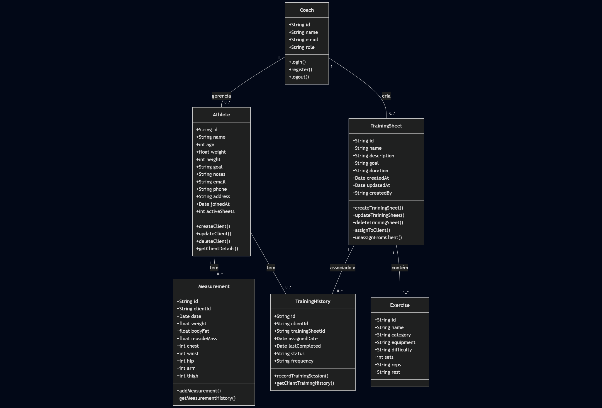

# FitTrack - Sistema de Controle de Fichas de Treino

## Informações da Equipe

- **Turma:** 3º Período ADS - Embarque
- **Membros da Equipe:**
  - Dayanne Moraes
  - Douglas Araújo
  - Ewerton Monteiro
  - Gabriel Farias
  - Lucas Mateus

## Descrição do Produto

**FitTrack** é um sistema desenvolvido para gerenciar fichas de treino em academias de musculação. Ele permite que instrutores criem, atualizem e acompanhem o progresso dos alunos de forma eficiente, oferecendo uma solução prática para personalizar treinos e monitorar resultados. O sistema registra exercícios, ajusta cargas conforme a evolução do aluno e gera relatórios de progresso, trazendo organização e valor tanto para instrutores quanto para alunos.

### Funcionalidades Principais
- Cadastro de alunos com nome, idade e objetivo (ex.: hipertrofia, emagrecimento).
- Criação de fichas de treino personalizadas com exercícios (nome, grupo muscular, carga).
- Atualização de cargas para refletir o progresso dos alunos.
- Visualização do histórico de fichas e da ficha atual.
- Exclusão de fichas antigas para manter o sistema organizado.
- Geração de relatórios de progresso para avaliação de resultados.

### Público-Alvo
- Instrutores de academias que precisam gerenciar treinos de forma estruturada.
- Alunos que desejam acompanhar seus exercícios e progresso.

### Diagrama de Classes

---

## Entregas

### Entrega 01 - 22/03/2025
- **Status:** Concluída
- [**Histórias Definidas para Implementação**](https://github.com/users/araujodgdev/projects/4/views/1)
- [**Protótipo Lo-Fi**](https://www.figma.com/design/GHusuNKl7TkhTesnnDT8r7/Lofi---POO?node-id=0-1&t=Y5i5rakeeiaZYXqU-1)
- [**Screencast do Protótipo Lo-Fi**](https://www.youtube.com/watch?v=r2qKeTZtQXA)

### Entrega 02 - 09/04/2025
- **Status:** Concluída
- [**Histórias Implementadas**](https://github.com/users/araujodgdev/projects/4)
- [**Screencast da Segunda Entrega**](https://www.youtube.com/watch?v=9Lu8a2bwEDw)

---