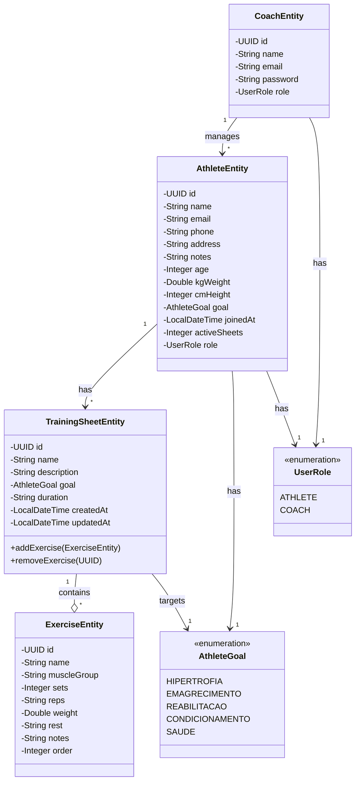

# Diagrama de Classes do Sistema FitTrack

## Descrição do Diagrama

O diagrama de classes acima representa a estrutura do sistema FitTrack, um aplicativo para gerenciamento de treinamento físico. Abaixo está a descrição dos componentes e seus relacionamentos:

### Entidades Principais

1. **AthleteEntity**: Representa um atleta/aluno no sistema.
   - Armazena informações pessoais como nome, contato, medidas físicas e objetivo de treinamento
   - Possui um objetivo de treinamento (AthleteGoal) e um papel no sistema (UserRole)

2. **CoachEntity**: Representa um treinador/professor no sistema.
   - Armazena informações básicas e credenciais de acesso
   - Gerencia múltiplos atletas

3. **TrainingSheetEntity**: Representa uma ficha de treinamento.
   - Contém informações sobre o programa de treinamento
   - Possui um objetivo específico (AthleteGoal)
   - Contém múltiplos exercícios

4. **ExerciseEntity**: Representa um exercício dentro de uma ficha de treino.
   - Detalha especificações como séries, repetições, carga e descanso
   - Pertence a uma ficha de treinamento específica

### Enumerações

1. **AthleteGoal**: Define os possíveis objetivos de um programa de treinamento.
   - HIPERTROFIA: Aumento de massa muscular
   - EMAGRECIMENTO: Perda de peso
   - REABILITACAO: Recuperação pós-lesão
   - CONDICIONAMENTO: Melhoria da capacidade física
   - SAUDE: Manutenção da saúde geral

2. **UserRole**: Define os papéis no sistema.
   - ATHLETE: Usuário do tipo atleta
   - COACH: Usuário do tipo treinador

### Relacionamentos

1. Um treinador (CoachEntity) gerencia múltiplos atletas (AthleteEntity).
2. Um atleta (AthleteEntity) pode ter múltiplas fichas de treino (TrainingSheetEntity).
3. Uma ficha de treino (TrainingSheetEntity) contém múltiplos exercícios (ExerciseEntity).
4. Tanto atletas quanto fichas de treino estão associados a um objetivo (AthleteGoal).
5. Atletas e treinadores possuem papéis específicos no sistema (UserRole).

Este diagrama representa a estrutura básica do sistema FitTrack, focando nas entidades principais e seus relacionamentos. A implementação atual pode ter relacionamentos implícitos que não estão diretamente mapeados nas classes, mas são representados aqui para maior clareza conceitual.